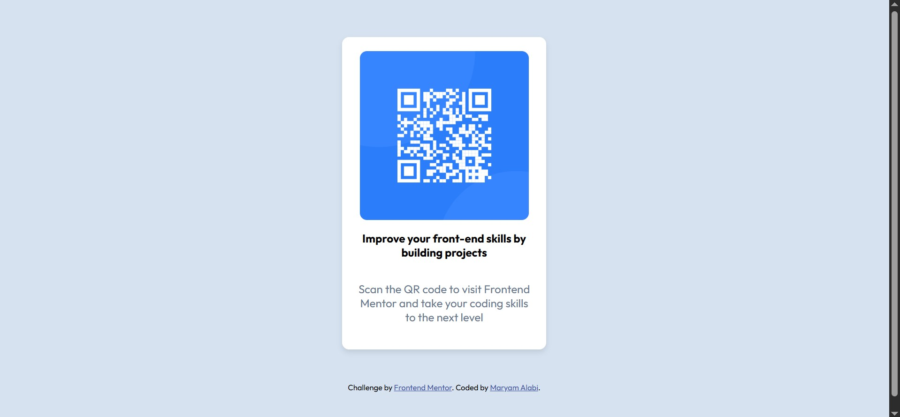

# Frontend Mentor - QR code component solution

## Table of contents

- [Overview](#overview)
  - [Screenshot](#screenshot)
  - [Links](#links)
  - [Built with](#built-with)
  - [What I learned](#what-i-learned)
- [Author](#author)

## Overview
This is my solution to the [QR code component challenge on Frontend Mentor](https://www.frontendmentor.io/challenges/qr-code-component-iux_sIO_H). Frontend Mentor challenges help you improve your coding skills by building realistic projects. 
### Screenshot




### Links

- Solution URL: https://www.frontendmentor.io/solutions/qr-code-card-component-jb0DwvVuWz
- Live Site URL:  https://morrryyyyy.github.io/qr_code_component/ 


### Built with

- Semantic HTML5 markup
- CSS custom properties
- Flexbox

### What I learned
How to use flexbox to center an element.
```css
body {
  background-color: var(--light-gray);
  font-family: "Outfit", sans-serif;
  font-weight: 400; /* Default font weight */
  display: flex;
  min-height: 100vh;
  flex-direction: column;
  justify-content: space-evenly;
  align-items: center;
  text-align: center;
}
```
How to use variables in css
```css
:root {
  --white: hsl(0, 0%, 100%);
  --light-gray: hsl(212, 45%, 89%);
  --grayish-blue: hsl(216, 15%, 48%);
  --dark-blue: hsl(218, 44%, 22%);
}
```
## Author

- Frontend Mentor - [@morrryyyyy](https://www.frontendmentor.io/profile/morrryyyyy)

